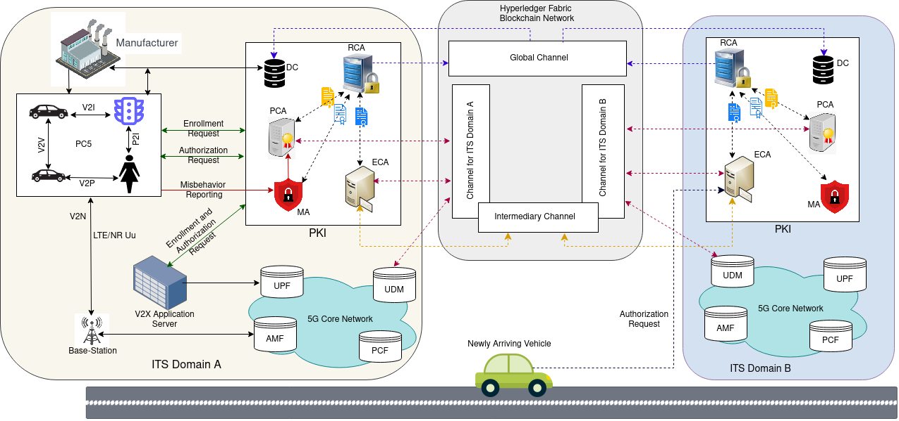

# Distributed-and-decentralized-5G-V2X-communication-Using-HyperLedger-Fabric-Blockchain-Network
A Blockchain based 5G V2X communication platform in which the main entities in 5G V2X communication including the 5G core network, the Public Key Infrastructure, the ITS-Station (vehicles, pedestrians, road side units and other authorities on the road) are integrated in a decentralized and interoperable manner. The blockchain network used is the Hyperledger Fabric supported by the Hyperledger Composer Framework.

# Architecture of proposed System

